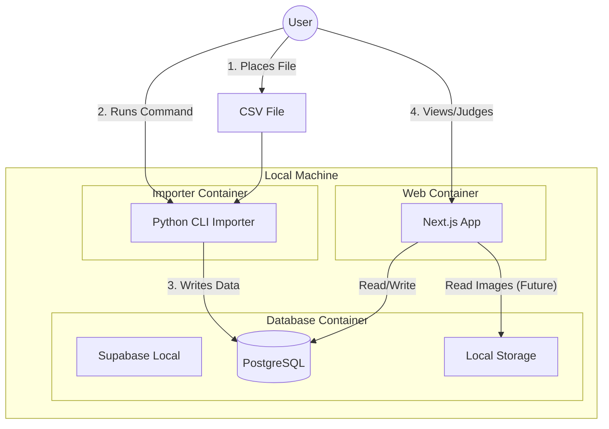

# System Architecture

## High-Level Overview

---

## Components

### 1. Python Importer (`importer/`)
- **Role**: Data Ingestion Gateway.
- **Responsibility**: 
    - Parsing specific CSV formats (Adapter pattern).
    - Normalizing text (Vendor renaming).
    - Generating fingerprints.
    - Ensuring idempotency (File Checksums).
- **Tech**: Python 3.11+, Standard libraries (csv, hashlib), no heavy framework.

### 2. Database (`supabase/`)
- **Role**: Source of Truth.
- **Responsibility**:
    - Data persistence.
    - enforcing constraints (FK, Check).
    - Storing Schema.
- **Tech**: PostgreSQL 15 (via Supabase).

### 3. Frontend (`frontend/`)
- **Role**: Interaction Layer.
- **Responsibility**:
    - **Overview**: Monthly financials.
    - **Triage Queue**: Interface for judging `transactions` into `transaction_business_info`.
    - **Transactions List**: Searchable, filterable history.
- **Tech**: Next.js 14 (App Router), React, Tailwind.

---

## Data Flow: The "Triage" Cycle

1. **Ingest**: `transactions` are inserted by Importer. `transaction_business_info` is NULL.
2. **Detect**: Frontend queries `transactions` LEFT JOIN `transaction_business_info` WHERE `transaction_business_info.id` IS NULL.
3. **Judge**: User selects an item, marks as "Business (50%)" or "Personal".
4. **Persist**: Frontend inserts record into `transaction_business_info`.
5. **Report**: Overview page aggregates `transactions.amount_yen * transaction_business_info.business_ratio` (defaulting to 0 if null).
